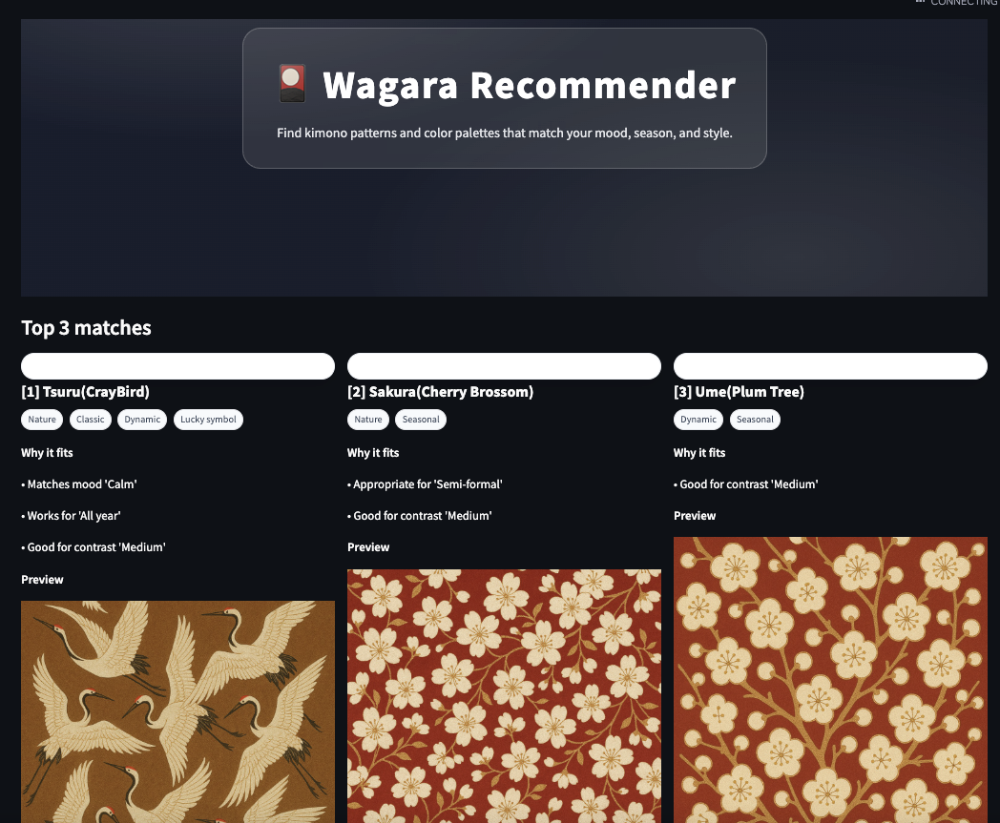

# Wagara Recommender (Streamlit)

Find kimono (wagara) patterns that match your mood, season, and style — and preview them with your own images.



> Put a screenshot at `assets/screenshots/app_home.png`.  
> You can change the path above if you prefer a different location/name.

---

## Features

- 🔎 **Top 3 recommendations** based on gender, mood, season, formality, motif, and contrast
- 🖼️ **Image-first cards**: pattern cards always try to show images (linked → fuzzy filename match → gallery fallback)
- ➕ **Simple Add**: upload an image → name the pattern → (optional) tags; palette auto-extracted from the image
- 🗂️ **Image link manager** and **bulk pattern import**
- 🖼️ **Gallery** view of all images in `assets/patterns`
- 🌄 **Custom hero background** from `assets/backgrounds/hero_placeholder.png`

---

## Quick Start

```bash
# 1) (optional) create a virtual environment
python -m venv .venv
# macOS/Linux
source .venv/bin/activate
# Windows (PowerShell)
# .\.venv\Scripts\activate

# 2) install dependencies
pip install -U pip
pip install -r requirements.txt  # or: pip install streamlit pillow

# 3) run
streamlit run streamlit_app.py
